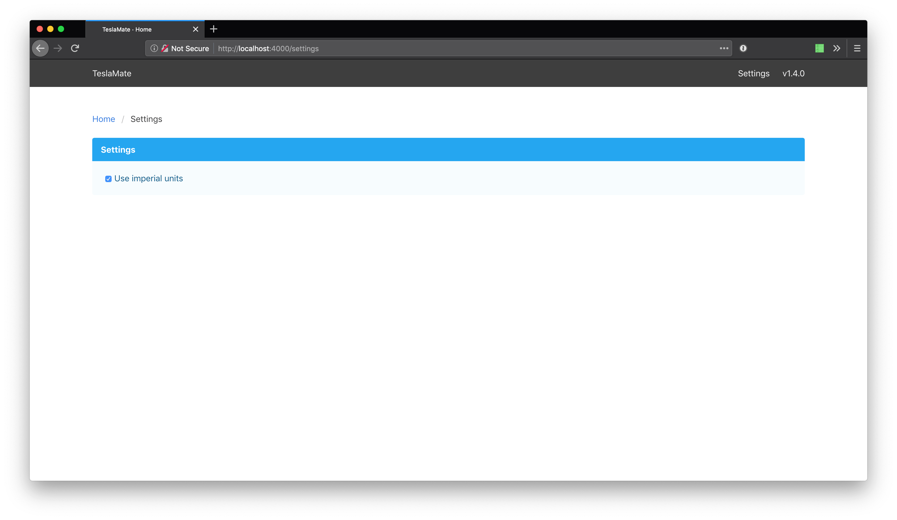

# Changelog

## [1.12.0-dev] - unreleased

We finally have **documentation**! Many thanks to [@ngardiner](https://github.com/ngardiner) for kicking it off and for doing most of the work and also thanks to [@krezac](https://github.com/krezac) for contributing a guide to creating iOS Shortcuts for TeslaMate!

### New Features

#### Vehicle Efficiency

Previous versions of TeslaMate shipped with hard-coded efficiency values for the various Tesla models. These efficiency values are needed to calculate trip consumptions, because the Tesla API does not provide them directly.

The hard-coded efficiency values were _probably_ pretty accurate, but I could never ensure the correctness of all of them. In addition, the new Model S and X "Raven" could not be reliably identified because the Tesla API often returned wrong option codes for both.

This version eliminates the need to use hard-coded values and instead calculates them dynamically based on the recorded charging data. It takes **at least two** charging sessions to display the first estimate. Each charge will slightly improve the accuracy of the estimate, which is applied retroactively to all data.

#### Charge energy used

In addition to the kWh added to the battery during the charge TeslaMate now calculates the actual energy used by the charger, which in most cases is higher than the energy added to the battery.

Consider this feature "experimental". Theoretically, however, it should be pretty accurate as long as the vehicle has a stable mobile/WiFi connection while charging (other _paid_ Tesla loggers use the same calculation method). To see TeslaMate's assessment of the correctness of the calculated value, hover over or tap the underlined field (in Grafana).

If you have feedback or can even verify/compare the calculated value with a real measurement (e.g. from your wallbox), I would be very happy to hear from you!

#### New MQTT Topics

- `teslamate/cars/$car_id/update_available`: Indicates if a car software update is available
- `teslamate/cars/$car_id/is_climate_on`: Indicates if the climate control is on
- `teslamate/cars/$car_id/is_preconditioning`: Indicates if the vehicle is being preconditioned
- `teslamate/cars/$car_id/is_user_present`: Indicates if a user is present in the vehicle

### Enhancements

- Disable origin check by default to ease the installation of TeslaMate.

  ⚠️ If you have a publicly exposed TeslaMate instance, I recommend to re-enable the origin check by adding the environment variable `CHECK_ORIGIN=true` (this requires that the variable `VIRTUAL_HOST` is present).

- Show icon indicators for various things (sentry mode, locked, windows open, pre-conditioning etc.)
- Various UI Tweaks
- Show the precise duration of a drive in a tooltip
- Serve gzipped assets

### Bug Fixes

- Set the correct end date of charges where the vehicle remains plugged in after the charge is completed
- Fix an issue with vehicles that were removed from the Tesla Account
- Handle API responses which indicate that the vehicle is in service
- Display effects of range gains (e.g. from supercharging pre-conditioning a cold battery) as NULL

---

```text
TeslaMate is open source and completely free for everyone to use.

If you like this project and want to support further development, please consider making a donation.
```

## [1.11.1] - 2019-10-13

### Bug Fixes

- Show all cars in the Overview dashboard

## [1.11.0] - 2019-10-12

### New Features

- Add overview dashboard (by DBemis;
  [#196](https://github.com/adriankumpf/teslamate/pull/196))
- Make :check_origin option configurable via environment variable
  `CHECK_ORIGIN`
- Open GitHub release page when clicking the version tag in the navbar
- Display the current software version

### New MQTT topics

- `teslamate/cars/$car_id/version`: Current software version

### Enhancements

- Tweak the mobile and desktop views
- Add GIST index based on `ll_to_earth` to speed up geo-fence lookups
- Improve accuracy of geo-fence lookups for some edge cases
- Log option codes as well if the vehicle identification fails
- Delete trips with less than 10m driven
- Add/Update efficiency factors

### Bug Fixes

- Fix an issue where postgres' automatic analyze couldn't succeed
- Fix an issue where the derived efficiency factors could not be calculated
- Exit early if migrations fail
- Downgrade Grafana to v6.3.5

## [1.10.0] - 2019-10-05

### Enhancements

- Allow editing of geo-fence positions
- Show warning icon if the health check fails for a vehicle
- Use the best available SRTM data source which provides global elevation data
  including 60N and above
- Optimize the comparison of geo-fences by moving the lookup into the database
- Use the exact position instead of the center of an address for the geo-fence
  lookup
- Generally improve error handling and error messages
- Improve landscape mode on devices with a notch

* Open the geo-fence editor by clicking on the start or destination address of
  a trip

  **Note:** For this feature to work Grafana needs to know the base URL of the
  TeslaMate web interface. To automatically set the base URL open the web
  interface once after upgrading to this version. Manually changing the base
  URL is possible via the settings page.

#### New MQTT topics

- `teslamate/cars/$car_id/healthy`: Reports the health status of the logger
- `teslamate/cars/$car_id/windows_open`
- `teslamate/cars/$car_id/shift_state`
- `teslamate/cars/$car_id/latitude`
- `teslamate/cars/$car_id/longitude`
- `teslamate/cars/$car_id/odometer`
- `teslamate/cars/$car_id/charge_port_door_open`
- `teslamate/cars/$car_id/charger_actual_current`
- `teslamate/cars/$car_id/charger_phases`
- `teslamate/cars/$car_id/charger_power`
- `teslamate/cars/$car_id/charger_voltage`
- `teslamate/cars/$car_id/time_to_full_charge`

### Bug Fixes

- Automatically restart parts of the application if Tesla decides yet again to
  change the IDs of some vehicles
- Request to sign in again if the access tokens become invalid e.g. because the
  password of the Tesla Account has been changed
- Protect against empty payloads during an update to prevent an update from
  not being fully logged
- Log the number of charging phases as returned by the API

### ⚠️ Running Migrations

_Users of the default `docker-compose.yml` can skip this part._

To run the migrations successfully, the database user has to have
superuser rights (temporarily):

- To add superuser rights: `ALTER USER teslamate WITH SUPERUSER;`
- To remove superuser rights: `ALTER USER teslamate WITH NOSUPERUSER;`

## [1.9.1] - 2019-09-24

### Fixed

- Set position when selecting a search entry
- Fix deletion of geo-fences

## [1.9.0] - 2019-09-24

### Added

- Show a map with the current vehicle position on the web interface
- Add a satellite/hybrid layer to the geo-fence map
- Use elevation data with 1 arc second (~30m) accuracy everywhere not just in
  the US
- Add support for MQTT SSL ([#140](https://github.com/adriankumpf/teslamate/pull/140))
- Add "Charged" annotation to the degradation dashboard
- Add preferred range setting: you can now choose between "ideal" and "rated"
  range to use as the basis for efficiency and other metrics

### Changed

- Require a data source named "TeslaMate":

  If you don't run the `teslamate/grafana` docker container the Grafana data
  source has to have the name "TeslaMate". Prior to this change the default
  data source was used.

- Renamed the MQTT topic `teslamate/cars/$car_id/battery_range_km` to
  `teslamate/cars/$car_id/rated_battery_range_km`.

### Fixed

- Prevent suspending when an update is in progress
- Fix charge counter when using with multi vehicles
  ([#175](https://github.com/adriankumpf/teslamate/pull/175))

### Removed

- Drop support for the deprecated env variables `TESLA_USERNAME` and
  `TESLA_PASSWORD`

## [1.8.0] - 2019-09-03

### Added

- Identify cars by VIN: This hopefully eliminates any upcoming problems when
  Tesla decides yet again to change the IDs of their cars ...
- Pick geo-fences from a map and show their radius

### Fixed

- Only add elevation to positions for which SRTM elevation data is available
- [Security] Bump Grafana version

## [1.7.0] - 2019-08-29

### Added

- Locally (!) query all locations for elevation data from the NASA Shuttle
  Radar Topography Mission (SRTM)
- Add elevation graph to the `Drive Details` dashboard
- Display rated range on the web interface and on the `Drive Details` dashboard
- Switch to the `vehicle_config` API endpoint to identify vehicles
- Display the default and derived efficiency factor on the `Efficiency` dashboard
  to detect inaccuracies and to **crowdsource** the correct factors:

  **Note:** If there is no default efficiency factor or you think the default factor for
  your vehicle might be wrong, please open an issue and attach a screenshot of
  the table showing the efficiency factor(s) for your vehicle.

- Display charger power on the web interface

### Fixed

- Fix calculation of `charge_energy_added` if a previously stopped charge
  session is resumed

## [1.6.2] - 2019-08-26

### Fixed

- Fix migration that could panic when upgrading from v1.4 to v1.6
- Fix efficiency calculation

## [1.6.1] - 2019-08-25

### Added

- Add separately configurable sleep requirements

### Fixed

- Improve identification of performance models
- Fix Model X identification
- Improve browser compatibility of the web interface
- Disable basic auth in Grafana
- Remove pre-calculated consumption columns and instead calculate consumption
  values dynamically based on the given efficiency factor
- Add various database constraints to keep data in a consistent state

## [1.6.0] - 2019-08-18

### Added / Changed

**Dashboards**

- Display car name instead of its id and replace dropdown with separate row for each car
- Improve States dashboard:
  - show state names instead of arbitrary numbers
  - include drives and charge sessions
- Vampire Drain: include offline state when calculating the standby value
- Drive Details: add estimated range graph
- Degradation: Increase resolution of projected 100% range

**Web UI**

- Add favicons
- Fetch last known values from database after (re)starting TeslaMate
- Show duration of current state
- Show estimated range
- Hide stale temperature data
- Hide some metrics when they're not needed

### Fixed

- Interpret a significant offline period with SOC gains as a charge session
- Timeout drive after being offline for too long
- Dashboards: Dynamically calculate consumption values based on stored `car.efficiency`

## [1.5.3] - 2019-08-14

### Fixed

- Add extra values to the "Time to Try Sleeping" dropdown
- Rollback the "Time to Try Sleeping" setting to previous pre v1.5 value (21 min) to play it safe

  **Note to Model 3 owners and everyone who likes to tweak things a bit**: most
  cars seem to handle a value of 12min just fine. Doing so reduces the
  likelihood of potential data gaps. Just keep an eye on your car afterwards to
  see if it still goes into sleep mode.

- Enable filtering of charges by date
- Fix charges query to include the very first charge

## [1.5.2] - 2019-08-13

### Fixed

- Fix migration that could panic if upgrading from &lt;v1.4.3 to v1.5

## [1.5.1] - 2019-08-13

### Fixed

- Remove `shift_state` condition which could prevent some cars from falling asleep

## [1.5.0] - 2019-08-12

### Added

- Add geo-fence feature
- Make units of length and temperature separately configurable
- Make `time to try sleeping` and `idle time before trying to sleep` configurable
- Show buttons `try to sleep` and `cancel sleep attempt` on status screen if possible
- Add charging stats: charged in total, total number of charges, top charging stations

### Changed

- Reduce time to try sleeping from 21 to 12 minutes
- Increase test coverage
- Rename some dashboards / panels

### Fixed

- Add order by clause to degradation query
- Read `LOCALE` at runtime

## 1.4

**1. New custom grafana image: `teslamate/grafana`**

Starting with this release there is a customized Grafana docker image
(`teslamate/grafana`) that auto provisions the datasource and dashboards which
makes upgrading a breeze! I strongly recommend to use it instead of manually
re-importing dashboards.

Just replace the `grafana` service in your `docker-compose.yml`:

```YAML
  # ...

  grafana:
    image: teslamate/grafana:latest
    environment:
      - DATABASE_USER=teslamate
      - DATABASE_PASS=secret
      - DATABASE_NAME=teslamate
      - DATABASE_HOST=db
    ports:
      - 3000:3000
    volumes:
      - teslamate-grafana-data:/var/lib/grafana

  # ...
```

And add a new volume at the bottom of the file:

```YAML
volumes:
    # ...
    teslamate-grafana-data:
    # ...
```

Find the full example in the updated README.

**2. Switch to imperial units**



There is a new settings view in the web interface. To use imperial measurements
in grafana and on the status screen just tick the checkbox it shows!

**3. Deprecation of TESLA_USERNAME and TESLA_PASSWORD**

With this release API tokens are stored in the database. After starting
TeslaMate v1.4 once, you can safely remove both environment variables.

New users need to sign in via the web interface.

**Full Changelog:**

## [1.4.3] - 2019-08-05

### Added

- Status screen: show additional charging related information
- MQTT: add new topics

  ```text
  teslamate/cars/$car_id/plugged_in
  teslamate/cars/$car_id/scheduled_charging_start_time
  teslamate/cars/$car_id/charge_limit_soc
  ```

### Fixed

- Fix an issue where charging processes were not completed and new charging
  processes were created after waking up from sleep mode while still plugged in
  to a charger.
- Add migration to fix incomplete charging processes
- Use local time in debug logs:

  Add a `TZ` variable with your local timezone name to the environment of the
  `teslamate` container. Otherwise timestamps use UTC.

- Charging History: hide entries with 0kWh charge energy added
- Charging History: include current `car-id` in links to `Charging` dashboard
- Charging History: use slightly earlier start date in links to `Charging`
  dashboard to always show the current position

## [1.4.2] - 2019-08-01

### Fixed

- Persists tokens after auto refresh

## [1.4.1] - 2019-07-31

### Fixed

- Convert to imperial measurements on status screen
- Fix warnings

## [1.4.0] - 2019-07-31

### Dashboards

#### Added

- Introduce custom teslamate/grafana Docker image
- Fetch unit variables from database

#### Fixed

- Fix syntax errors in consumption and charging dashboard
- The consumption and charging dashboards can now be viewed without having to
  select a drive / charging process first.

#### Removed

- The German dashboard translations have been removed. It was too time
  consuming to keep everything up to date.

### TeslaMate

#### Added

- Show version on web UI
- Persist API tokens
- Add sign in view
- Add settings view

#### Changed

- Log :car_id

#### Fixed

- Fix generation of `secret_key_base`

## [1.3.0] - 2019-07-29

#### Changed

- Fix / inverse efficiency calculation: if distance traveled is less than the
  ideal rated distance the efficiency will now be lower than 100% and vice-versa.

  **Important: re-import the Grafana Dashboards (`en_efficiency` & `en_trips`) after restarting TeslaMate**

## [1.2.0] - 2019-07-29

#### Added

- Add psql conversion helper functions (**via database migration**)
- Report imperial metrics

  **Important: please re-import the Grafana Dashboards after restarting TeslaMate**

#### Fixed

- Remove TZ environment variable from Dockerfile

## [1.1.1] - 2019-07-27

#### Changed

- Upgrade tesla_api
- Upgrade Phoenix LiveView

#### Fixed

- Fix a few english translations in the en dashboards
- Remove `DATABASE_PORT` from docker-compose example
- Remove port mapping from postgres in docker-compose example
- Extend FAQ

## [1.1.0] - 2019-07-27

#### Added

- Support custom database port through `DATABASE_PORT` environment variable
- Add entrypoint to handle db migration

#### Changed

- Replace `node-sass` with `sass` to speed up compilation

#### Fixed

- Update README.md to fix resume and suspend logging PUT requests.

## [1.0.1] - 2019-07-26

#### Changed

- Set unique :id to support multiple vehicles
- Reduce default pool size to 5
- Install python in the builder stage to build on ARM
- Increase timeout used on assert_receive calls

## [1.0.0] - 2019-07-25

[1.12.0-dev]: https://github.com/adriankumpf/teslamate/compare/v1.11.1...HEAD
[1.11.1]: https://github.com/adriankumpf/teslamate/compare/v1.11.0...v1.11.1
[1.11.0]: https://github.com/adriankumpf/teslamate/compare/v1.10.0...v1.11.0
[1.10.0]: https://github.com/adriankumpf/teslamate/compare/v1.9.1...v1.10.0
[1.9.1]: https://github.com/adriankumpf/teslamate/compare/v1.9.0...v1.9.1
[1.9.0]: https://github.com/adriankumpf/teslamate/compare/v1.8.0...v1.9.0
[1.8.0]: https://github.com/adriankumpf/teslamate/compare/v1.7.0...v1.8.0
[1.7.0]: https://github.com/adriankumpf/teslamate/compare/v1.6.2...v1.7.0
[1.6.2]: https://github.com/adriankumpf/teslamate/compare/v1.6.1...v1.6.2
[1.6.1]: https://github.com/adriankumpf/teslamate/compare/v1.6.0...v1.6.1
[1.6.0]: https://github.com/adriankumpf/teslamate/compare/v1.5.3...v1.6.0
[1.5.3]: https://github.com/adriankumpf/teslamate/compare/v1.5.2...v1.5.3
[1.5.2]: https://github.com/adriankumpf/teslamate/compare/v1.5.1...v1.5.2
[1.5.1]: https://github.com/adriankumpf/teslamate/compare/v1.5.0...v1.5.1
[1.5.0]: https://github.com/adriankumpf/teslamate/compare/v1.4.3...v1.5.0
[1.4.3]: https://github.com/adriankumpf/teslamate/compare/v1.4.2...v1.4.3
[1.4.2]: https://github.com/adriankumpf/teslamate/compare/v1.4.1...v1.4.2
[1.4.1]: https://github.com/adriankumpf/teslamate/compare/v1.4.0...v1.4.1
[1.4.0]: https://github.com/adriankumpf/teslamate/compare/v1.3.0...v1.4.0
[1.3.0]: https://github.com/adriankumpf/teslamate/compare/v1.2.0...v1.3.0
[1.2.0]: https://github.com/adriankumpf/teslamate/compare/v1.1.1...v1.2.0
[1.1.1]: https://github.com/adriankumpf/teslamate/compare/v1.1.0...v1.1.1
[1.1.0]: https://github.com/adriankumpf/teslamate/compare/v1.0.1...v1.1.0
[1.0.1]: https://github.com/adriankumpf/teslamate/compare/v1.0.0...v1.0.1
[1.0.0]: https://github.com/adriankumpf/teslamate/compare/3d95859...v1.0.0
