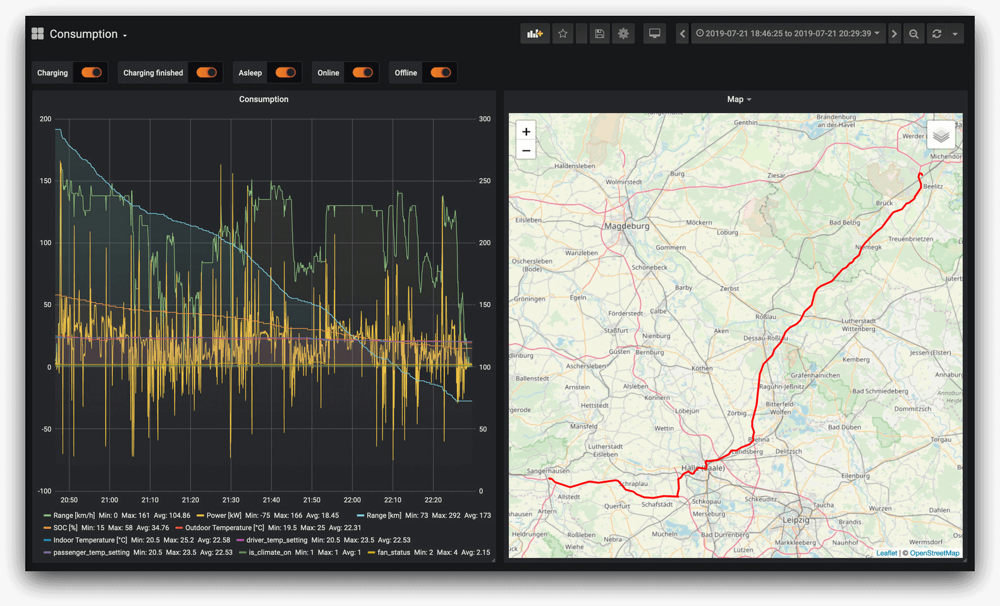
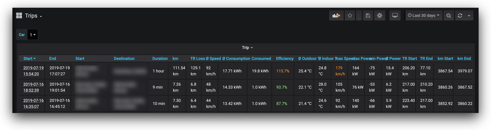
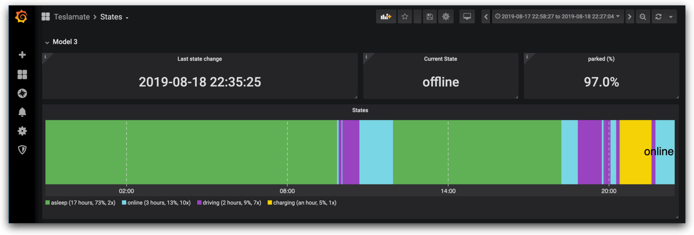
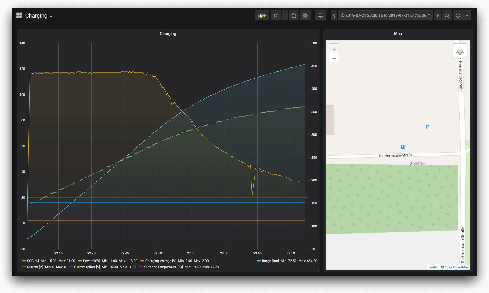
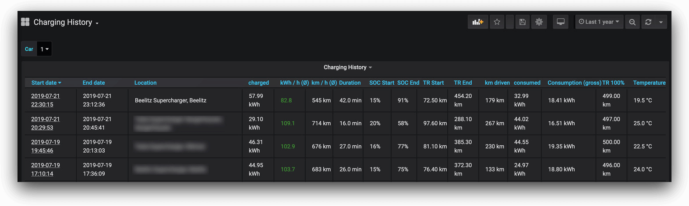
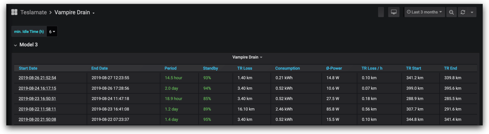
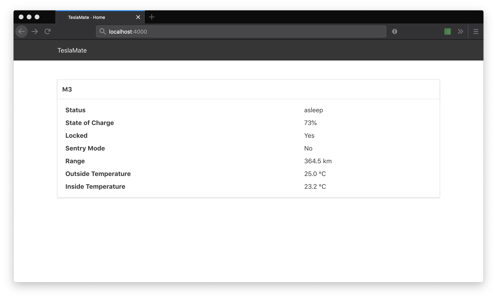

# TeslaMate

[](https://travis-ci.org/adriankumpf/teslamate)
[](https://coveralls.io/github/adriankumpf/teslamate?branch=master)
[](https://microbadger.com/images/teslamate/teslamate)
[](https://microbadger.com/images/teslamate/teslamate)


A data logger for your Tesla.

- Written in [Elixir](https://elixir-lang.org/)
- Data is stored in PostgreSQL
- Visualization and data analysis with Grafana
- Current vehicle data is published to a local MQTT Broker _(optional)_

**⚡⚡ CHECK OUT THE [CHANGELOG](CHANGELOG.md) BEFORE UPGRADING TO V1.4 ⚡⚡**

## Features

**Dashboards**

- Lifetime driving map
- Drive and charging reports
- Driving efficiency report
- Consumption (net / gross)
- Vampire drain
- Projected 100% range (battery degradation)
- SOC charging stats
- Visited addresses
- History of installed updates

**General**

- Little to no additional vampire drain: the car will fall asleep after a
  certain idle time
- Built-in API to manually suspend / resume sending requests to the Tesla API
- Automatic address lookup
- Supports multiple vehicles per Tesla Account

## Screenshots








1. [Installation](#installation)
2. [Configuration](#configuration)
3. [Upgrading](#upgrading)
4. [Web Interface](#web-interface)
5. [MQTT](#mqtt)
6. [FAQ](#faq)

---

## Installation

### Docker (recommended)

The recommended way to install and run TeslaMate is to use Docker. Create a
`docker-compose.yml` file and replace the necessary `environment` variables:

```YAML
version: '3'
services:
  teslamate:
    image: teslamate/teslamate:latest
    restart: unless-stopped
    environment:
      - DATABASE_USER=teslamate
      - DATABASE_PASS=secret
      - DATABASE_NAME=teslamate
      - DATABASE_HOST=db
      - MQTT_HOST=mosquitto
      - VIRTUAL_HOST=localhost # if you're going to access the UI from another  machine replace
                               # "localhost" with the hostname / IP address of the docker host.
      - TZ=Europe/Berlin       # (optional) replace to use local time in debug logs. See "Configuration".
    ports:
      - 4000:4000
    cap_drop:
      - all

  db:
    image: postgres:11
    environment:
      - POSTGRES_USER=teslamate
      - POSTGRES_PASSWORD=secret
    volumes:
      - teslamate-db:/var/lib/postgresql/data

  grafana:
    image: teslamate/grafana:latest
    environment:
      - DATABASE_USER=teslamate
      - DATABASE_PASS=secret
      - DATABASE_NAME=teslamate
      - DATABASE_HOST=db
    ports:
      - 3000:3000
    volumes:
      - teslamate-grafana-data:/var/lib/grafana

  mosquitto:
    image: eclipse-mosquitto:1.6
    ports:
      - 1883:1883
      - 9001:9001
    volumes:
      - mosquitto-conf:/mosquitto/config
      - mosquitto-data:/mosquitto/data

volumes:
    teslamate-db:
    teslamate-grafana-data:
    mosquitto-conf:
    mosquitto-data:
```

Afterwards start everything with `docker-compose up`.

Open the web interface at http://ip-of-your-machine:4000 and sign in with your
Tesla Account.

To access Grafana go to http://ip-of-your-machine:3000.

**Optional:** To switch to **imperial measurements** open the web interface,
navigate to `Settings` and tick the checkbox.

### Manual Installation (advanced)

To run TeslaMate without Docker follow this guide: [Manual
Installation](https://github.com/adriankumpf/teslamate/wiki/Manual-Installation)

## Configuration

TeslaMate uses environment variables for runtime configuration.

### Environment Variables

| Variable Name          | Description                                                                                                                                                                                                      | Default Value                 |
| ---------------------- | ---------------------------------------------------------------------------------------------------------------------------------------------------------------------------------------------------------------- | ----------------------------- |
| DATABASE_USER          | Username (**required**)                                                                                                                                                                                          | /                             |
| DATABASE_PASS          | User password (**required**)                                                                                                                                                                                     | /                             |
| DATABASE_NAME          | The database to connect to (**required**)                                                                                                                                                                        | /                             |
| DATABASE_HOST          | Hostname of the database server (**required**)                                                                                                                                                                   | /                             |
| DATABASE_PORT          | Port of the database server                                                                                                                                                                                      | 5432                          |
| DATABASE_POOL_SIZE     | Size of the database connection pool                                                                                                                                                                             | 5                             |
| VIRTUAL_HOST           | Host part used for generating URLs throughout the app                                                                                                                                                            | localhost                     |
| PORT                   | Port where the web interface is exposed                                                                                                                                                                          | 4000                          |
| DISABLE_MQTT           | Disables the MQTT feature if `true`                                                                                                                                                                              | false                         |
| MQTT_HOST              | Hostname of the broker (**required** unless DISABLE_MQTT is `true`)                                                                                                                                              | /                             |
| MQTT_USERNAME          | Username _(optional)_                                                                                                                                                                                            | /                             |
| MQTT_PASSWORD          | Password _(optional)_                                                                                                                                                                                            | /                             |
| ENABLE_LOGGER_TELEGRAM | Enables a [logger backend](https://github.com/adriankumpf/logger-telegram-backend) for telegram. If `true` error and crash reports are forwarded to the configured chat. Usually not needed for stable releases. | false                         |
| CHAT_ID                | Telegram chat id (only **required** if `ENABLE_LOGGER_TELEGRAM` is `true`). See [here](https://github.com/adriankumpf/logger-telegram-backend#configuration) for instructions.                                   | /                             |
| TOKEN                  | Telegram bot token (only **required** if `ENABLE_LOGGER_TELEGRAM` is `true`). See [here](https://github.com/adriankumpf/logger-telegram-backend#configuration) for instructions.                                 | /                             |
| LOCALE                 | The default locale for the web interface and addresses. Currently available: `en` (default) and `de`                                                                                                             | en                            |
| TZ                     | Used to establish the local time zone. See [List of tz database time zones](https://en.wikipedia.org/wiki/List_of_tz_database_time_zones).                                                                       | /                             |
| SECRET_KEY_BASE        | Secret key used as a base to generate secrets for encrypting and signing data                                                                                                                                    | randomly generated at startup |
| SIGNING_SALT           | A salt used with secret_key_base to generate a key for signing/verifying a cookie (required by LiveView; Sessions are not used otherwise)                                                                        | randomly generated at startup |

## Upgrading

> Check the [Changelog](CHANGELOG.md) before upgrading!

### Docker

Run `docker-compose pull` and restart with `docker-compose up`.

### Manually

See [Manual Installation](https://github.com/adriankumpf/teslamate/wiki/Manual-Installation#upgrading)

## Web Interface

There is a basic real-time web interface. Once the application is running locally, you
can access it at [localhost:4000](http://localhost:4000).



## MQTT

Unless the MQTT feature is disabled data is published to the following topics
(`$car_id` usually starts at 1):

```
teslamate/cars/$car_id/display_name
teslamate/cars/$car_id/state
teslamate/cars/$car_id/battery_level
teslamate/cars/$car_id/ideal_battery_range_km
teslamate/cars/$car_id/charge_energy_added
teslamate/cars/$car_id/plugged_in
teslamate/cars/$car_id/scheduled_charging_start_time
teslamate/cars/$car_id/charge_limit_soc
teslamate/cars/$car_id/speed
teslamate/cars/$car_id/outside_temp
teslamate/cars/$car_id/inside_temp
teslamate/cars/$car_id/locked
teslamate/cars/$car_id/sentry_mode
```

## FAQ

**Sometimes the first few minutes of a drive are not recorded even though the
car was online. Why?**

TeslaMate polls the car every few seconds while driving or charging. After
that, it keeps polling for about 15 minutes (to catch the following drive if
you stopped for a drink, for example). After this period, TeslaMate will stop
polling the car for about 12 minutes to let it go to sleep. This is repeated
until the car is asleep or starts to drive/charge again. Once sleeping,
TeslaMate will never wake the wake the car. It is only checked twice a minute to
see if it is still sleeping.

This approach may sometimes lead to _small_ data gaps: if the car starts
driving during the 12 minute period where TeslaMate is not polling, nothing can
be logged.

**Solution:** To get around this you can use your smartphone to inform TeslaMate
when to start polling again. In short, create a workflow with
[Tasker](https://play.google.com/store/apps/details?id=net.dinglisch.android.taskerm&hl=en)
(Android) or [Shortcuts](https://support.apple.com/guide/shortcuts/welcome/ios)
(iOS) that listens for connected Bluetooth devices. If a connection to your
Tesla is established send an HTTP PUT request to your publicly exposed
TeslaMate instance.

_(With iOS 12 and below workflows are quite limited but can be triggered
manually. iOS 13 will probably fix that.)_

```
PUT https://teslamate.your-domain.com/api/car/$car_id/logging/resume
PUT https://teslamate.your-domain.com/api/car/$car_id/logging/suspend
```

I strongly recommend to use a reverse-proxy with HTTPS and basic access
authentication when exposing TeslaMate to the public internet. Additionally
only permit access to `/api/car/$car_id/logging/resume` and/or
`/api/car/$car_id/logging/suspend`.

## Contributions

All Contributions are welcome and greatly appreciated!

## Disclaimer

Please note that the use of the Tesla API in general and this software in
particular is not endorsed by Tesla. Use at your own risk.

## Credits

- [TeslaLogger](https://github.com/bassmaster187/TeslaLogger) was a big
  inspiration especially during early development. Thanks!
