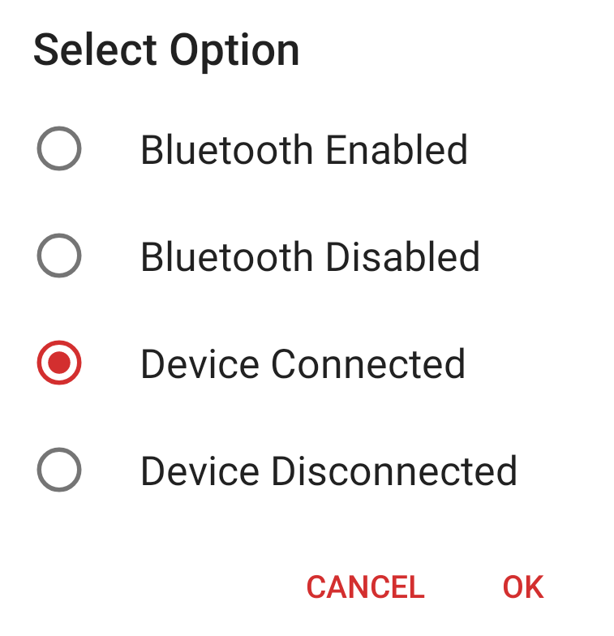
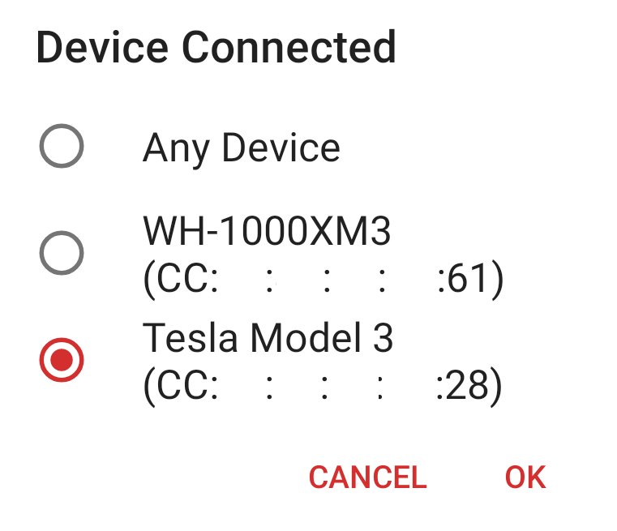

# MacroDroid Setup

_Note: This guide is currently a work in progress. Check back soon for a complete walkthrough!_

## Introduction

MacroDroid is an Android application with similar features to Tasker, but with a free version that provides:

- Up to 5 macros in total (_we will use up to 2 for TeslaMate_).
- Ads within the User Interface.

## Creating a Macro

Launch MacroDroid. The first screen that you will see has a number of tiles. In order to set up a macro to send resume hints to TeslaMate, click on the **Add Macro** button to the right of the screen.

You will be prompted for a Macro Name and Category. Provide the following Details:

- **Category**: Uncategorized
- **Name**: TeslaMateResume

### Defining a Trigger

In MacroDroid, a trigger is the event that causes a task to execute. We will define a trigger that is activated each time a Bluetooth connection is established between a smartphone and a Tesla vehicle device over Bluetooth.

- A list of trigger options will appear. Click on the **Connectivity** section to expand this section.
- From the list of options provided, select **Bluetooth Event**.
- A number of Bluetooth Connection Events will appear. Select **Device Connected**.
- You should see the **Device Connected** screen appear, with a list of your paired Bluetooth devices. Select your Tesla vehicle from the list.

### Constraints

We will not configure any constraints for the Macro we have created. When the Constraints screen appears, with **(No Constraints)** being the default setting, simply click the checkmark in the bottom-right hand corner of the screen to finish setting up your macro.
