# iOS Shortcuts Setup

_Note: This guide is currently a work in progress. Check back soon for a complete walkthrough!_

## Introduction

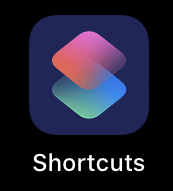

Shortcuts is an iOS application ("internal" since 13.1) with similar features to Tasker or MacroDroid on Android. It's meant to create shortcuts (sequence of actions triggered manually) or automations (sequence of actions triggered by events - i.e. Bluetooth device connected).

Unfortunately, only couple of the useful events (like NFC on NFC enabled phones) can be fully automated without user interaction, most of them require confirming the action. See [Shortcuts documentation](https://support.apple.com/guide/shortcuts/enable-or-disable-a-personal-automation-apd602971e63/ios) (section: Enable an automation to run without asking) for more details.

## Assumptions

These values are used in the screenshots. Whenever you see them, replace them with the actual values used on your system.

- Your wake up endpoint is exposed at: **https://teslamate.example.com/wake** and proxied to something like `http://teslamate:4000/api/car/$car_id/logging/resume` where `$car_id` is 1 if you have only one car.
- The Endpoint is protected by **Basic Authentication** with the user **mylogin** and password **mysecretpassword**. Note that this **IS NOT** your Tesla password.

## Setup the automation

**NOTE:** The UI looks and behaves slightly differently depending on whether you are creating a new automation or editing an existing one.

### Creating a "Bluetooth device connected" Automation

- Launch Shortcuts.
- Switch to Automation screen (center icon on bottom of the screen).
- To create automation, click small blue **+** icon in upper right corner.
- Select **Create Personal Automation** (upper blue option).
- Scroll down to **Settings** block and select **Bluetooth**.
- Click **Device**, select your Tesla (you need to have it paired already) and click **Done** (upper right corner).
- Click **Next** (upper right corner). This brings you to the list of actions (empty for now).

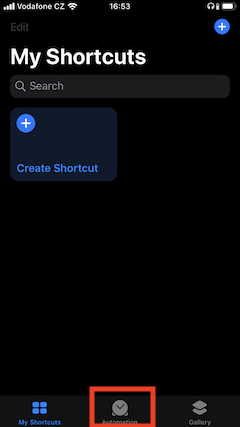 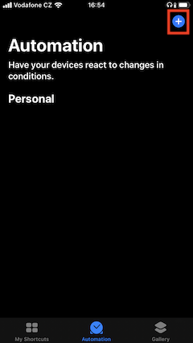 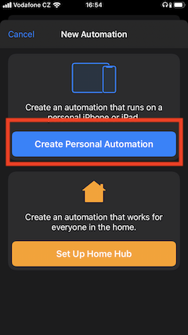
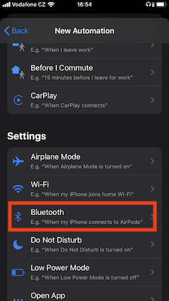 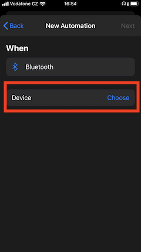 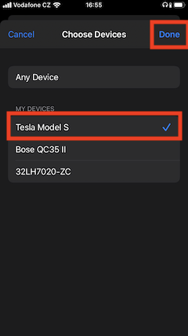

### Building an action

- Click **Add Action** button. This brings you to the list of available actions.
- Select **Documents**, tap on the **Text** block and select the **Text** field.
- Type in your login and password separated by colon e.g. `mylogin:mysecretpassword`

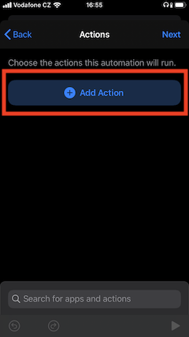 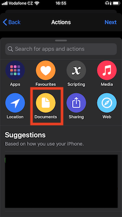 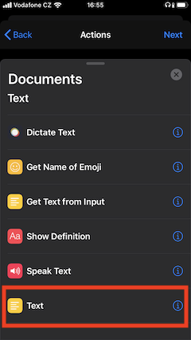
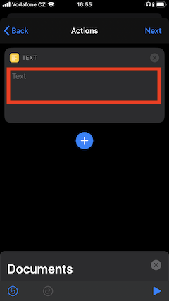

- Click **+** icon below the actions. This brings you to the list of available actions.
- You will be back in Documents. **DO NOT** (I know, it's tempting) press Back, you'd lose the previously entered actions in such case. Instead, scroll up and click the gray **X** next to Documents. This will bring you to the categories of action.
- Select **Scripting** (gray icon), go to **Files** block and select **Base64 Encode**.

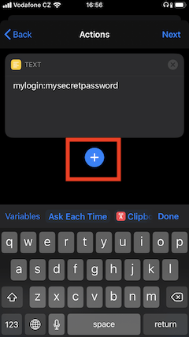 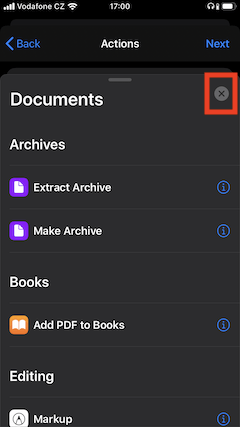 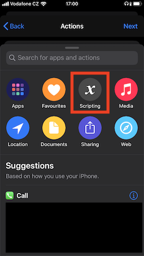
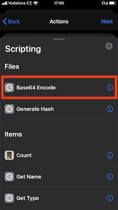

- Click the **+** icon below the actions. This brings you to the list of available actions.
- Click the gray **X** to close Scripting category.
- Select **Web** (cyan icon), go to **URLs** block and select **URL**.
- Type in your endpoint public URL e.g. `https://mytm.myweb.com/wake`

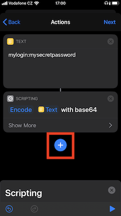 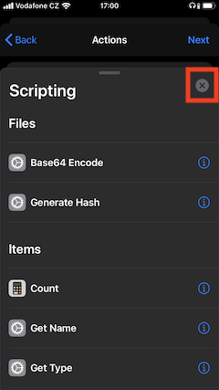 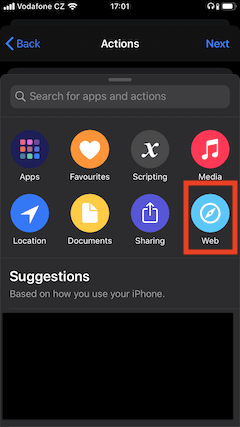
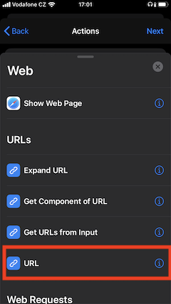

- Click the **+** icon below the actions. This brings you to the list of available actions.
- Stay in **Web** (cyan icon) again, go to **Web Requests** block and select **Get Contents of URL**.
- In the newly added action, click **Show more**
- Change **Method** to **PUT**.
- Click **Headers**

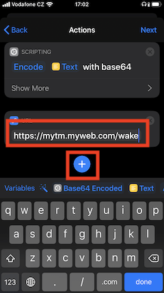 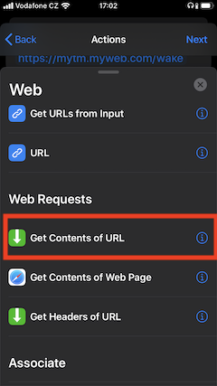 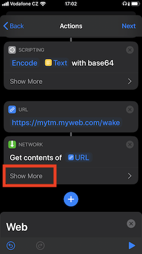
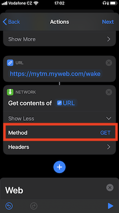 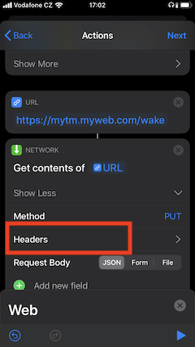

- In the **Headers** section, click on **Add new header** (green + icon).
- Type **Authorization** in **Key** box and **"Basic "** (without the quotes, note the **space** after **Basic**) into the **Value** box.
- While still in **Value** box, click **Base64 Encoded** on **Variables** panel (bottom of the screen). It will be added to **Value**.

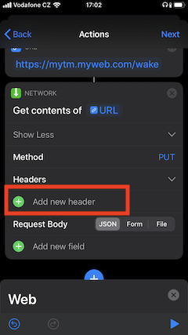 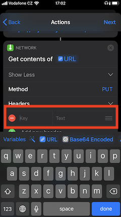 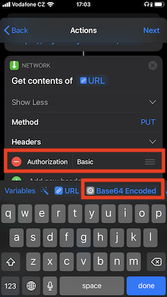
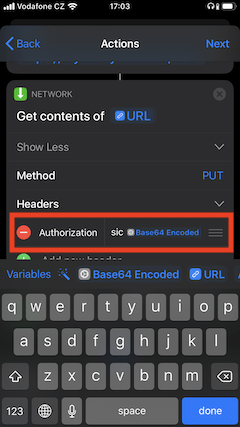

### Saving an Automation

- Click **Next** (upper right corner), it will bring you to the summary page.
- Click **Done** (upper right corner), it will bring you to the main screen (list of automations).
- You have your new automation ready.

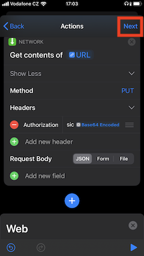 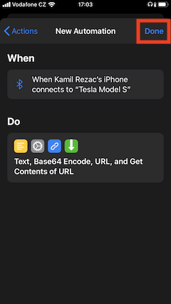 

## Enabling / Disabling / Editing the Automation

- Click the automation
- Turn on/off the **Enable this automation**.
- If you need to edit something, click thru to the appropriate part of the automation.
- Save by clicking **Done**.

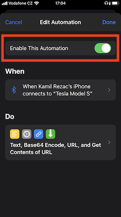 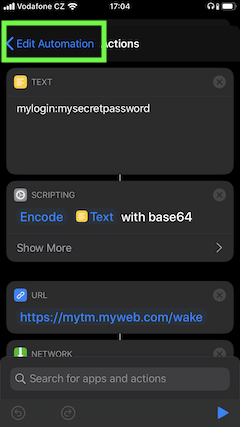

## Running the Automation

- Get into the car and wake it up by pressing the brake pedal (if needed).
- Once the Bluetooth connects, you will see notification on your lock screen.
- Click **Run** button.
- Done.

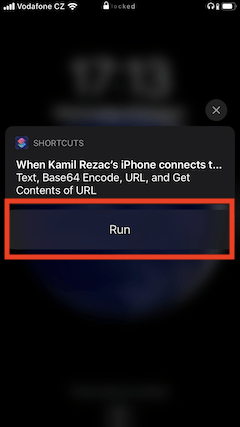 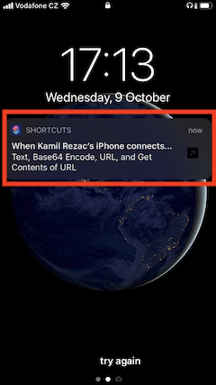
