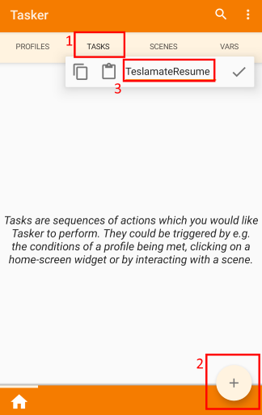
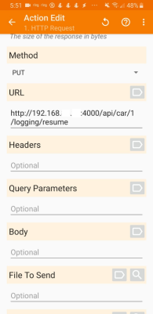
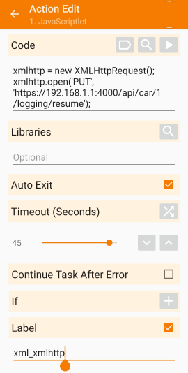
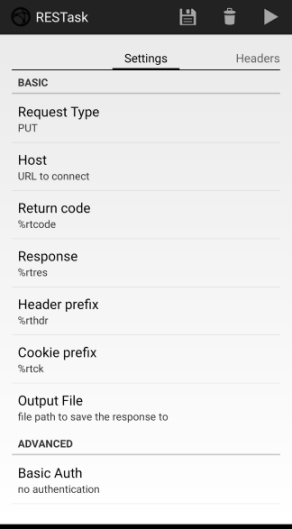
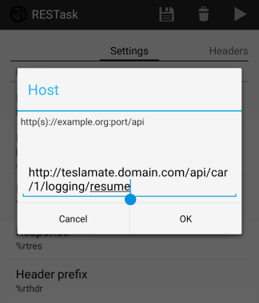
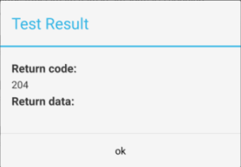
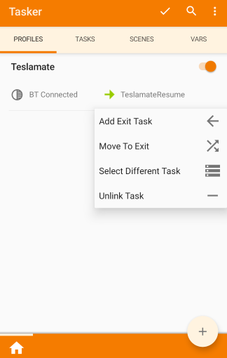

# Tasker Setup for Android

## Introduction

This walkthrough provides a step-by-step configuration for the installation and configuration of Tasker in order to detect the Bluetooth connection between your mobile phone and your Tesla vehicle, to push a resume hint to TeslaMate every time your phone connects locally to Tesla's Bluetooth.

_Credit goes to [jun3280net](https://github.com/jun3280net) and [MertonKnight](https://github.com/MertonKnight) for content used within this guide._

### Install Tasker and open the app

Tasker should be downloaded from the [Google Play Store](https://play.google.com/store) (paid application). Open the Tasker app once the application is installed on your phone.



### Create an action

At this point, we define an action that will be executed in the event that the Bluetooth connection to the Tesla is detected. There are a number of different ways that we can trigger TeslaMate to resume logging. Each of the options is documented below, along with pros and cons to the use of these functions.

- In Tasker, select the **Tasks** tab.
- Click the Plus sign in the bottom-right hand of the screen.
- Name the task **TeslaMateResume**.
- Select the checkmark to confirm adding the new task.

You will then see the Create Action screen, which will require you to select one of the following three approaches to waking TeslaMate. Different approaches have different limitations, so ensure that you read the options below (and the note on accessing TeslaMate remotely) before configuring this step.

#### Notes about calling the TeslaMate logging resume function

Please note that in the following examples, we will be specifying a URL to call in order to wake the TeslaMate logging routine. The examples will use a local IP address (for example, 192.168.1.1). The limitation with this approach is that this function will only work when you are connected to your home LAN (via Wifi). If you would like the function to work outside of your home LAN, your TeslaMate instance needs to be reachable remotely.

There are two key ways that this can be achieved:

- Use a VPN solution such as Wireguard or [OpenVPN](https://github.com/adriankumpf/teslamate/issues/102#issuecomment-531497214)
- Make your TeslaMate instance publicly available (see [Advanced Docker Setup](../../installation/docker_advanced.md) for an example).



#### Using HTTP only (HTTP Request)

The HTTP Request plugin can be used to send a HTTP request to TeslaMate. Note that this plugin cannot send HTTPS requests, only HTTP, and cannot perform basic authentication for HTTP requests. If you have a reverse proxy such as nginx redirecting HTTP to HTTPS, you may need to use a different plugin.

- **Method**: PUT
- **URL**: http://**ip-address**:**port**/api/car/**car_id\**/logging/resume
- **Headers**: None
- **Query Parameters**: None
- **Body**: None



#### Using HTTP or HTTPS (JavaScriptlet)

If you would like to send logging resume hints to a TeslaMate instance behind an HTTPS web server or proxy, one option is to use a JavaScriptlet. This allows the use of JavaScript to call the XMLHttpRequest function, which then causes a request to be sent to your TeslaMate instance.

- In the list of actions on the Select Action screen, type in _java_
- Select **JavaScriptlet**

You will see a screen similar to that on the right-hand side. The code to use is:

```
xmlhttp = new XMLHttpRequest();
xmlhttp.open('PUT', 'https://192.168.1.1:4000/api/car/1/logging/resume');
```

If you need to do HTTP basic authentication, you may be able to do so with the following, command, which should be placed between the two lines above:

```
xmlhttp.setRequestHeader("Authorization", "Basic " + btoa("yourusername:yourpassword"));
```

- **Auto Exit**: Enable this option
- **Timeout (seconds)**: 45 Seconds
- **Label**: xml_xmlhttp

#### Using HTTP or HTTPS with Authentication (RESTask Plugin)

Using the RESTask plugin requires installation of an additional android package. This package provides the ability to craft complex HTTP or HTTPS requests, including using basic authentication.

- Install the following [Plugin](https://play.google.com/store/apps/details?id=com.freehaha.restask&hl=en_US) from the Google Play Store.
- In the list of tasker functions, search using the term _rest_ until you find **REStask**, and select it.

Provide the following details:

- **Request Type**: PUT
- **Host**: `http://teslamate.domain.com/api/car/1/logging/resume`
- **Basic Auth**: _Configure authentication if it is used in your environment_

 

- Press the Play button in the top-right hand corner of the screen to test the task. You should get a HTTP 204 (Successful with no response body) response from TeslaMate.



- See the Testing Your Task section below to ensure you see the output expected.

### Creating a Profile

Now that the action to trigger the connection to TeslaMate has been created, we create a profile which will trigger the action in the event that a Bluetooth connection is established to a Tesla vehicle.

- Select the **Profiles** tab in Tasker.
- Click on the Plus (+) sign in the bottom-right corner of the screen.
- Select State > Net > BT Connected
- Under **Name**, select the Bluetooth Device name of your Tesla vehicle.
- Under **Address**, select the Bluetooth Address of your Telsa vehicle.
- Select the **TeslaMateResume** task.

### Testing Your Task

When within Bluetooth range of your vehicle, turn off your Bluetooth connectivity on your phone. Turn it back on again, and wait for the Tesla app to re-establish connectivity with your vehicle.

- Check your TeslaMate logs, and verify that you see something similar to the following:




### Create an action for suspending logging

This step is optional, however it may improve the battery efficiency of your vehicle. In this step, you create a second task to be used for suspending logging once the vehicle is outside of Bluetooth range.

- In Tasker, select the **Tasks** tab.
- Click the Plus sign in the bottom-right hand of the screen.
- Name the task **TeslaMateSuspend**.
- Select the checkmark to confirm adding the new task.

- Select the same action that you selected for the initial resume task, and change the suspend in the URL to resume.

### Create an exit task for the Bluetooth profile

- Select the **Profiles** tab in tasker.
- Locate your Bluetooth Connected profile for your Tesla vehicle and press and hold the task until a menu appears.
- Select **Add Exit Task**.
- Select the **TeslaMateSuspend** task.

## Frequently Asked Questions

### How can I set this up for multiple Tesla vehicles?

This process could be repeated for multiple vehicles. What is important to do, is:

- Match the `$car_id` in the URL to the car you are sending the command for to the Bluetooth device.
- Replicate the Task and the Profile for the new vehicle. In effect, it requires following this entire guide for each vehicle.

### Why am I getting a HTTP 404 error when I trigger the task

More than likely, you're sending a HTTP GET request and not a HTTP PUT request. Check the log generated by TeslaMate, what is the method shown? If it is GET, you need to change the HTTP request to a PUT instead.

```
teslamate_1 | 15:37:51.802 [info] GET /api/car/1/logging/resume
teslamate_1 | 15:37:51.802 [info] Sent 404 in 247µs
teslamate_1 | 15:37:51.802 [info] Converted error Phoenix.Router.NoRouteError to 404 response
```

### Why am I getting a HTTP 412 error when I trigger the task

If your vehicle is not ready or not able to sleep, e.g. because sentry mode is active, you'll get HTTP status code 412.
