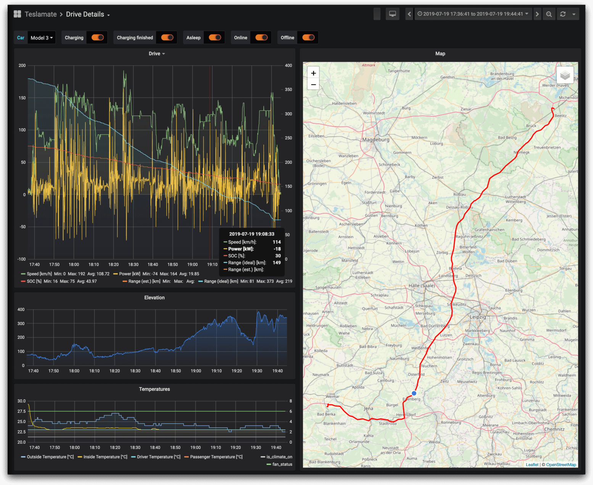

Tesla Mate
----------

A powerful, self-hosted data logger for your Tesla.

- Written in **Elixir**
- Data is stored in a **Postgres** database
- Visualization and data analysis with **Grafana**
- Vehicle data is published to a local **MQTT** Broker

Features
=========

Dashboards
~~~~~~~~~~

- Lifetime driving map
- Drive and charging reports
- Driving efficiency report
- Consumption (net / gross)
- Charge energy added vs energy used
- Vampire drain
- Projected 100% range (battery degradation)
- SOC charging stats
- Visited addresses
- History of installed updates

General
~~~~~~~

- Little to no additional vampire drain: the car will fall asleep after a certain idle time
- Automatic address lookup
- Locally enriches positions with elevation data
- Geo-fencing feature to create custom locations
- Supports multiple vehicles per Tesla Account

Screenshots
~~~~~~~~~~~

   The Drive Details dashboard in Grafana

   * Top-left Range information
   * Middle-left Elevation
   * Bottom-left Temperatures
   * Right Journey map and current location

.. figure:: screenshots/web_interface.png
   :target: screenshots/web_interface.png

   TeslaMate homepage

   * menu-bar: Geo-Fences, settings, version
   * Left: Current location of car
   * Right: Summary

`MORE SCREENSHOTS <screenshots.html>`_

Donations
~~~~~~~~~

TeslaMate is open source and completely free for everyone to use.

Maintaining this project isn't effortless, or free. If you would like to
support further development, that would be awesome. If you don't, no problem;
just share your love and show your support.

.. image:: images/paypal-donate-button.png
   :target: //www.paypal.com/cgi-bin/webscr?cmd=_s-xclick&hosted_button_id=YE4CPXRAV9CVL&source=url

Credits
~~~~~~~

- Authors: Adrian Kumpf
- `List of contributors <https://github.com/adriankumpf/teslamate/graphs/contributors>`_
- Distributed under MIT License

Documentation
=============

.. toctree::
   :maxdepth: 1
   :caption: Getting Started

   screenshots
   Simple Docker install inside your home network <installation/docker>
   Advanced Docker install (Reverse Proxy, HTTPS, HTTP Basic Auth) <installation/docker_advanced>
   Manual install on Debian or Ubuntu <installation/debian>
   upgrading
   faq

.. toctree::
   :maxdepth: 1
   :caption: Sleep configurations

   Documents the sleep behaviour for Tesla vehicles and the related TeslaMate configuration <configuration/sleep>
   configuration/guides/shortcuts
   configuration/guides/tasker
   configuration/guides/macro_droid

.. toctree::
   :maxdepth: 1
   :caption: Integrations

   integrations/home_assistant
   integrations/mqtt

.. toctree::
   :maxdepth: 1
   :caption: Advanced configuration

   configuration/environment_variables
   configuration/multi_tenancy
   configuration/environment_variables

.. toctree::
   :maxdepth: 1
   :caption: Development and Contributing

   development
