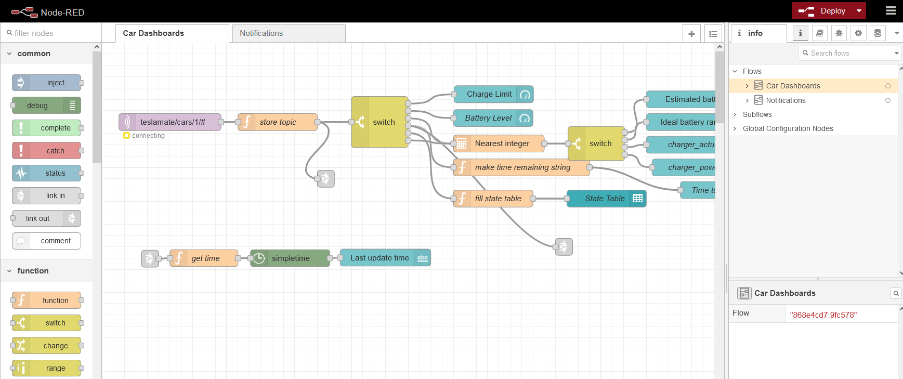
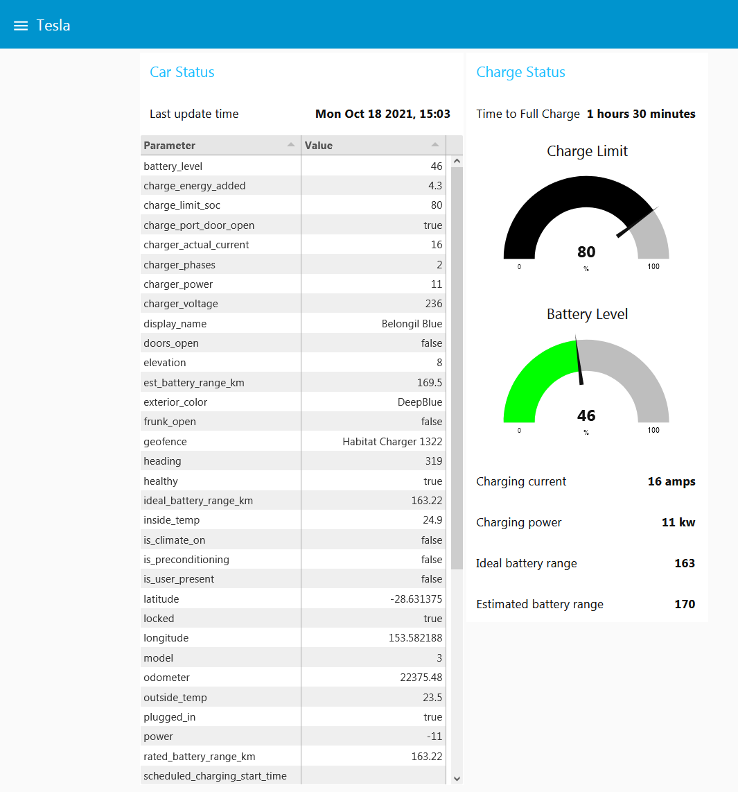
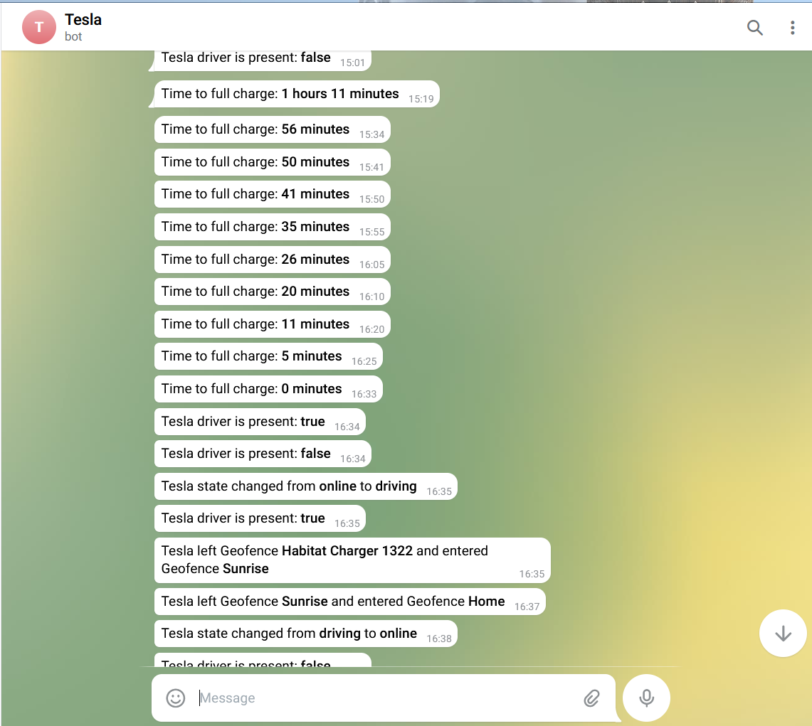
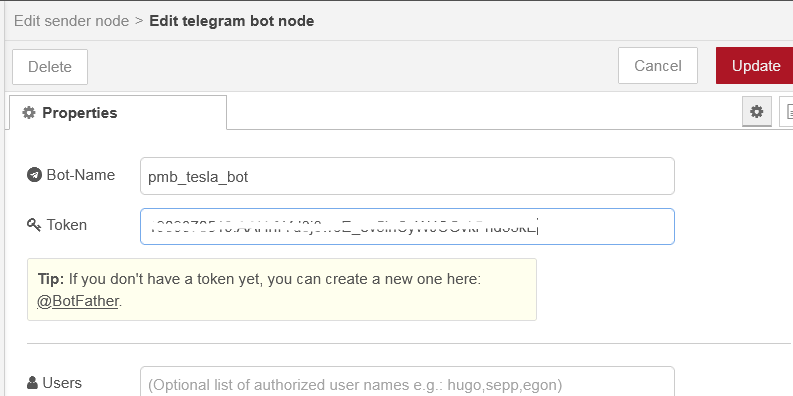

# Overview

From the Node-RED website:

> Node-RED is a programming tool for wiring together hardware devices, APIs and online services in new and interesting ways.
>
> It provides a browser-based editor that makes it easy to wire together flows using the wide range of nodes in the palette that can be deployed to its runtime in a single-click.

The high-level logic "flow" is coded by wiring "nodes" in the user interface. Low-level logic can be coded in JavaScript. Visit the [Node-RED website](https://nodered.org) for a good introduction on its homepage.

|                    **Node-RED UI**                    |
| :---------------------------------------------------: |
|  |

This integration guide assumes that Teslamate is deployed on docker and that Node-RED will not be exposed to the internet. Of course, you can install Node-RED outside of Docker and on another server, if that suits. The integration with Teslamate is entirely via MQTT. Notifications included in the examples are sent using available Node-RED modules for email and Telegram. Other notifications (e.g. Slack) are relatively simple by replacing the final node in the Notifications flow. One could also integrate with public tools such as IFTT. Or get really creative and integrate with Alexa or Google Assistant to control the car by voice. :)

Creation of the Telegram bot is not covered in this guide; there is plenty of documentation on the net explaining how to do this (links are provided in the _Requirements_ section below). However, the configuration of the Telgram node in Node-RED is described below.

Included are Node-RED flows with two examples:

- A simple Node-RED dashboard with Car Status and Charge Status panels
- Notification logic for state changes, entering/exiting geofences and time remaining to charge.

|                 **Node-RED Dashboard**                  |
| :-----------------------------------------------------: |
|  |

|          **Example Telegram Notifications**           |
| :---------------------------------------------------: |
|  |

# Requirements

- Teslmate environment, preferably installed in Docker (if you are new to Docker, see Installing Docker and Docker Compose)
- Access by Node-RED to the internet to send notifications
- A mobile device with [Telegram](https://telegram.org/) client installed or use Telegram's browser interface
- your own Telegram Bot, see [Creating a new telegram bot](https://core.telegram.org/bots#6-botfather)
- your own Telegram chat id, see [Get your Telegram chat ID](https://docs.influxdata.com/kapacitor/v1.5/event_handlers/telegram/#get-your-telegram-chat-id)

# Installing Node-RED

Visit the Node-RED [Getting Started](https://nodered.org/docs/getting-started/) page for the various deployment options. If you are using Docker, the following section should suffice to get running.

## Docker Entries

Add the following parameters to your `docker-compose.yml` file. It's assumed that your timezone in set in the .env file's TM_TZ environment variable.

```yaml title="docker-compose.yml"
services:
  node-red:
    image: nodered/node-red:latest
    restart: always
    environment:
      - TZ=${TM_TZ}
    volumes:
      - node-red-data:/data
    ports:
      - "1880:1880"

volumes:
  node-red-data:
```

Build and start the docker container with `docker-compose up`. To run the containers in the background, add the `-d` flag:

```
docker-compose up -d
```

# Node-RED Configuration

There are two flows in the example exports provided. The first flow creates a simple dashboard with some of the MQTT values. The second flow sends notifications to Telegram.
The flow names are "Car Dashboard" and "Notifications".

## Required Modules

After bringing up the Node-RED container the first time, save the following shell script to a file (e.g. named _add-nr-modules.sh_, then run `bash ./add-nr-modules.sh`) to install modules required for the example flows:

```bash title="add-nr-modules.sh"
:
MODULES="node-red-contrib-calc
node-red-contrib-simpletime
node-red-dashboard
node-red-node-email
node-red-contrib-telegrambot
node-red-node-ui-table"
set -x
for MODULE in $MODULES
do
docker-compose exec -T node-red npm install --no-audit --no-update-notifier --no-fund --save --save-prefix=~ --production $MODULE
done
docker-compose stop node-red
docker-compose start node-red
```

## Import Flows

- Download the example JSON file [Node-RED-Teslamate-flows.json](./Node-RED/Teslamate-flows.json.example)
- Go to Node-RED's hamburger menu in the upper right corner and select `Import`
- Use the `select file to import` button on the pop-up to upload the JSON file.

## MQTT Configuration

If you are using the standard MQTT docker configuration as per the Teslamate installation guide, after you import the flows Node-RED should automatically connect. Otherwise, open the `teslamate/cars/1/#` node in the Car Dashboard flow, select the pencil icon next to the `Server` field in the panel, then edit the MQTT server's parameters. Click Update, Done and Deploy.

## Telegram Configuration

To enter your Telegram Bot's parameters:

- Edit the `Status Messages` Telegram node in the Notifications flow, then select the pencil icon next to the `Bot` name.
- Replace the `Bot-Name` field with the name of your Telegram bot
- Fill the `Token` field with the value that you copied from setting up your bot.

|                     **Telegram configuration pop-up**                      |
| :------------------------------------------------------------------------: |
|  |

- Click `Update`, then `Done`
- Edit the `Format messages` node in the Notifications flow
- Replace the value for `chatId` with the chatId that you obtained setting up the bot.
- Click `Done`
- Click `Deploy` to re-deploy your flows. "Connected" should now display beneath the `Status Messages` node.

## Email configuration

If you want to quickly try out this implementation without Telegram, you can simply remove the connection between the `Format Messages` and `Status Messages` nodes, then connect `Format Messages` with the `email` node. Edit the email node to set your parameters to send emails. After you re-deploy you should get at least one message as per the note below.

## Notes

- When you re-deploy your flows, a _Tesla entered Geofence ..._ message and a _Tesla Driver is present:_ notification may be sent. Some might consider this a bug. Or a test that the notification channel is working. :)
