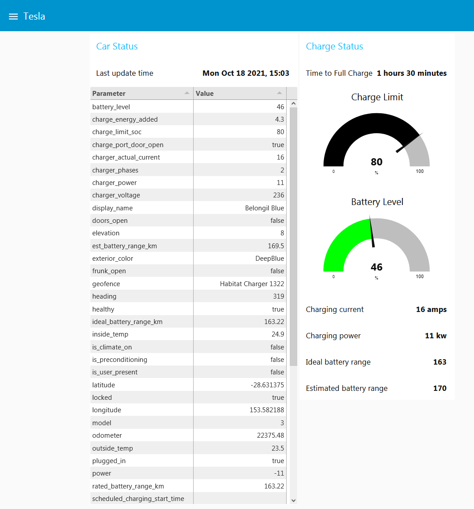

# 概述

来自 Node-RED 网站：

> Node-RED 是一种编程工具，用于以新的和有趣的方式将硬件设备、API 和在线服务连接起来。
>
> 它提供了一个基于浏览器的编辑器，使得使用调色板中广泛的节点轻松地将流程连接在一起，这些节点可以通过一次点击部署到其运行时。

高层次的逻辑 "flows" 是通过在用户界面上的布线 "nodes" 来编码的。低层次的逻辑可以用 JavaScript 编码。访问 [Node-RED 网站](https://nodered.org)，在其主页上有很好的介绍。

|                   **Node-RED 界面**                   |
| :---------------------------------------------------: |
|  |

本集成指南假设 Teslamate 部署在 docker 上，Node-RED 不会暴露在互联网上。当然，如果适合的话，你可以在 Docker 之外的其他服务器上安装 Node-RED。与 Teslamate 的整合完全是通过 MQTT 进行的。例子中包含的通知是使用现有的 Node-RED 模块发送的，用于电子邮件和 Telegram。其他的通知（例如 Slack）则相对简单，只需替换通知流程中的最后一个节点。人们还可以与公共工具（如 IFTT）集成。或者发挥真正的创造力，与 Alexa 或谷歌助手整合，通过语音控制汽车。:）

本指南不涉及 Telegram 机器人的创建；网络上有大量的文档解释如何做到这一点（链接在下面的 _要求_ 部分提供）。然而，下面将介绍 Node-RED 中 Telgram 节点的配置。

包括 Node-RED flows 的两个例子：

- 一个带有汽车状态和充电状态面板的简单的 Node-RED 仪表盘。
- 对状态变化、进入/离开地理围栏和充电剩余时间的通知逻辑。

|                   **Node-RED 仪表盘**                   |
| :-----------------------------------------------------: |
|  |

|                **Telegram 通知的例子**                |
| :---------------------------------------------------: |
|  |

# 要求

- Teslmate 环境，最好安装在 Docker 中（如果你从未接触过 Docker，请参阅安装 Docker 和 Docker Compose）
- 通过 Node-RED 访问互联网以发送通知
- 安装有 [Telegram](https://telegram.org/) 客户端的移动设备或使用 Telegram 的浏览器界面
- 你自己的 Telegram 机器人，见[创建一个新的 Telegram 机器人](https://core.telegram.org/bots#6-botfather)
- 你自己的 Telegram 聊天 ID，见[获取你的 Telegram 聊天 ID](https://docs.influxdata.com/kapacitor/v1.5/event_handlers/telegram/#get-your-telegram-chat-id)

# 安装 Node-RED

访问 Node-RED [Getting Started](https://nodered.org/docs/getting-started/) 页面了解各种部署选项。如果你使用的是 Docker，下面的部分应该足以让你开始运行。

## Docker 条目

在你的 `docker-compose.yml` 文件中添加以下参数。假设你的时区设置在 .env 文件的 TM_TZ 环境变量中。

```yaml title="docker-compose.yml"
services:
  node-red:
    image: nodered/node-red:latest
    restart: always
    environment:
      - TZ=${TM_TZ}
    volumes:
      - node-red-data:/data
    ports:
      - "1880:1880"

volumes:
  node-red-data:
```

用 `docker-compose up` 构建并启动 docker 容器。要在后台运行容器，请添加 `-d` 命令：

```
docker-compose up -d
```

# Node-RED 配置

在提供的出口示例中，有两个流程。第一个流程用一些 MQTT 值创建一个简单的仪表板。第二个流程向 Telegram 发送通知。
flows 的名称是 "Car Dashboard" 和 "Notifications"。

## 必备模块

第一次启动 Node-RED 容器后，将下面的 shell 脚本保存到一个文件中（例如命名为 _add-nr-modules.sh_，然后运行 `bash ./add-nr-modules.sh`）来安装 example flows 所需的模块：

```bash title="add-nr-modules.sh"
:
MODULES="node-red-contrib-calc
node-red-contrib-simpletime
node-red-dashboard
node-red-node-email
node-red-contrib-telegrambot
node-red-node-ui-table"
set -x
for MODULE in $MODULES
do
docker-compose exec -T node-red npm install --no-audit --no-update-notifier --no-fund --save --save-prefix=~ --production $MODULE
done
docker-compose stop node-red
docker-compose start node-red
```

## 导入 Flows

- 下载示例 JSON 文件[Node-RED-Teslamate-flows.json](./Node-RED/Teslamate-flows.json.example)
- 进入 Node-RED 右上角的汉堡包菜单，选择 `import`。
- 使用弹出窗口中的 `select file to import` 按钮，上传 JSON 文件。

## MQTT 配置

如果你按照 TeslaMate 安装指南使用标准的 MQTT docker 配置，在你导入流程后，Node-RED 应该自动连接。否则，在汽车仪表板流程中打开 `teslamate/cars/1/#` 节点，在面板中选择 `Server` 字段旁边的铅笔图标，然后编辑 MQTT 服务器的参数。点击更新、完成和部署。

## Telegram 配置

要输入你的 Telegram 机器人的参数：

- 编辑通知流程中的 `状态信息` Telegram 节点，然后选择 `Bot` 名称旁边的铅笔图标。
- 用你的 Telegram 机器人的名字替换 `Bot-Name` 字段
- 在 `Token` 字段中填入你在设置 Bot 时复制的数值。

|                         **Telegram 配置弹出窗口**                          |
| :------------------------------------------------------------------------: |
|  |

- 点击 `Update`，然后点击 `Done`
- 编辑通知流程中的 `Format messages` 节点
- 将 `chatId` 的值替换为您在设置机器人时获得的 chatId
- 点击 `Done`
- 点击 `Deploy` 重新部署你的流程。现在 "连接 "应该显示在 `Status Messages` 节点的下面

## 电子邮件配置

如果你想在没有 Telegram 的情况下快速尝试这个实现，你可以简单地删除 `Format Messages` 和 `Status Messages` 节点之间的连接，然后将 `Format Messages` 与 `email` 节点连接。编辑电子邮件节点，设置你的参数来发送电子邮件。在你重新部署后，你应该得到至少一条如下说明的信息。

## 备注

- 当你重新部署你的流量时，可能会发出 _Tesla entered Geofence ..._ 消息和 _Tesla Driver is present:_ 通知。有些人可能认为这是一个错误。或者说是对通知通道工作的测试。:)
